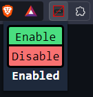

# Discord type indicator blocker

  

- Blocks others from seeing when you are typing.
- It works by matching `\*discord.com/api/\*/channels/\*/typing\*` (not regex, as the webAPI doesn't support it), through chrome's `updateDynamicRules()`.

## Build
- Run `npm install`, if you haven't already
- Run `npm run build`

## Configure
- Open the browser
- Click on the hamburger menu on the top right
- Click extensions
- Click load unpacked
- Click the folder which has this repository (the folder which has the manifest.json file)

## Troubleshooting
- In case it doesn't work, click on the extensions toolbar and find this extension. Click on it, and click `Enable`

## Issues
Brave has [issues](https://github.com/brave/brave-browser/issues/30854), and I've found a temporary fix as I have commented, but I've got to test it further

The issue should be fixed on version 0.0.3 of the extension
